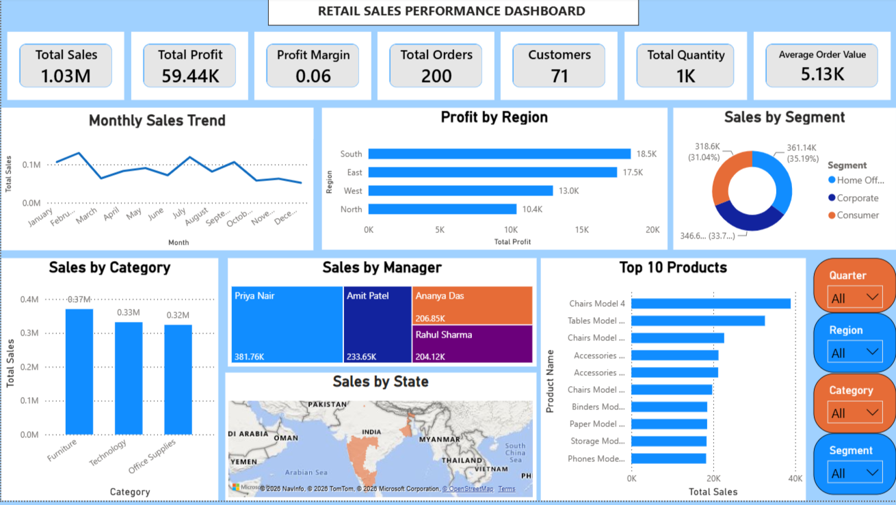

# Retail Sales Performance Dashboard

## Project Overview

This Power BI dashboard provides an interactive analysis of retail sales performance, enabling users to monitor key business metrics, identify sales trends, and gain actionable insights for data-driven decision-making.

## Objectives

- Monitor sales performance
- Analyze profit trends
- Compare regional sales
- Evaluate category performance
- Support business decision-making

## Dashboard Features

- Interactive KPI Cards for Sales, Profit, Orders, Customers, Quantity, and Average Order Value
- Monthly Sales Trend Visualization
- Region-wise Profit Analysis
- Customer Segment Performance Analysis
- Category-wise Sales Performance
- Sales Performance by Manager
- Top 10 Best-Selling Products Analysis
- State-wise Sales Map Visualization
- Interactive Slicers for Dynamic Filtering
- Business-Oriented Dashboard with Actionable Insights

## Tools Used

- Power BI
- Power Query
- DAX
- Microsoft Excel

## Key Insights

- Achieved **1.03M** in total sales.
- Generated **59.44K** in total profit.
- South region recorded the highest profit.
- Furniture was the highest-selling category.
- Home Office contributed the highest sales.
- Identified the Top 10 best-selling products.

## Dashboard Preview

## Author

Abdul Latheep